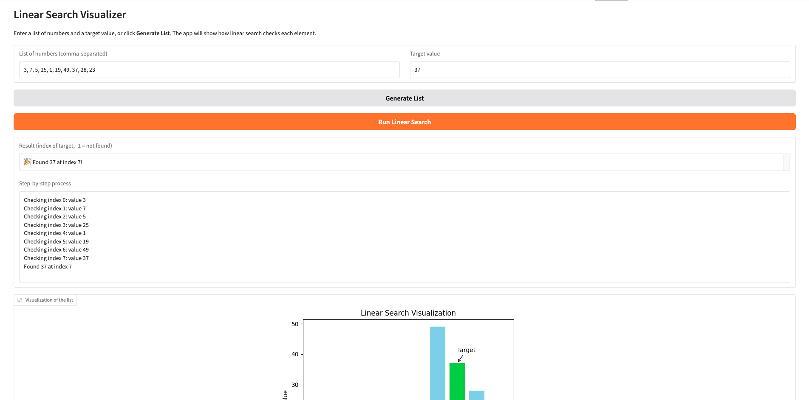
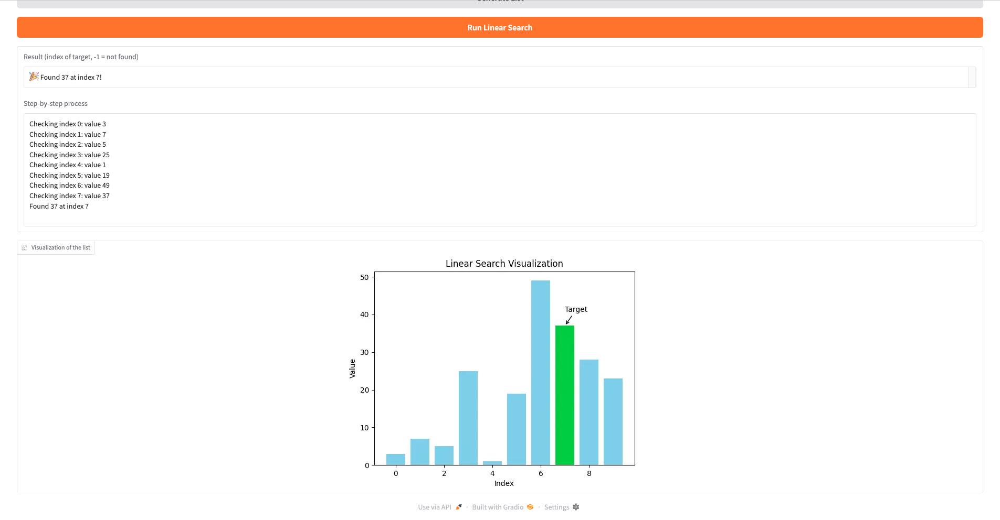

# Linear Search — CISC121 Final Project

This project is a simple web application designed to demonstrate how the Linear Search algorithm
works. Users can enter a list of numbers and a target value. The app displays the index where the target was
found (or -1), a step-by-step explanation, and a bar chart visualization. The interface is built using Gradio and
deployed on Hugging Face Spaces.

-----------------------------------------------------------

## Screenshots

### User Interface

### Successful Example

### Demonstration of Visualization

-----------------------------------------------------------

## Computational Thinking Breakdown

### 1. Decomposition
- Break the problem into smaller steps.
- Accept user input (string of numbers + target).
- Convert the string into a list of integers.
- Apply Linear Search to check elements one by one.
- Return the index and a step-by-step explanation.
- Display results and visualization in the UI.

### 2. Pattern Recognition
- Linear Search repeats the same process for each element:
check → compare → move to next index.

### 3. Abstraction
- Hide loops, comparisons, and logic from the user.
- Show only simple inputs and outputs.

### 4. Algorithm Design- Input: List + target.
- Processing: Sequential comparison.
- Output: Index or -1, steps, and a visualization.

-----------------------------------------------------------

## Algorithm Implementation
- linear_search() performs the search with step tracking.
- parse_list() validates and converts user input.
- search_interface() manages UI interaction and visualization.
- Matplotlib provides a bar chart to highlight the target index.
- Gradio powers the interactive user interface.

-----------------------------------------------------------

## Use of Python Libraries for the UI
- Gradio Textbox, Button, Markdown, and Plot components.
- Clean layout for ease of understanding.

-----------------------------------------------------------

## Testing & Verification

### Test 1
List: 1, 13, 25, 21, 15, 36, 14, 2, 32, 47
Target: 13
Expected: 1
Result: 1

### Test 2

List: 47, 19, 42, 31, 48, 33, 23, 45, 10, 22
Target: 5
Expected:  5 was not found (returned -1).
Result:  5 was not found (returned -1).

### Test 3

List: afdasdsfdd
Target: 7
Expected: Please enter a comma-separated list of integers, e.g. 3, 1, 4, 1, 5
Result: Please enter a comma-separated list of integers, e.g. 3, 1, 4, 1, 5 

-----------------------------------------------------------

## Steps to Run 
Visit hugging face webiste at the link attached below

-----------------------------------------------------------

## Hugging Face Link
https://huggingface.co/spaces/OwenSheppard/linear-search-cisc121-finalproject
## GitHub Repository
https://github.com/21ows1/cisc121_final_project/tree/main

-----------------------------------------------------------
## AI Assistance Statement
I used CHATGPT to help with brainstorming ideas, debugging, and wording parts of this README. I made sure to review all final code and explanations prior to my final project submission.
-----------------------------------------------------------
## Author & Acknowledgment

Owen Sheppard

Acknowledgment to CISC-121 course guidelines.
